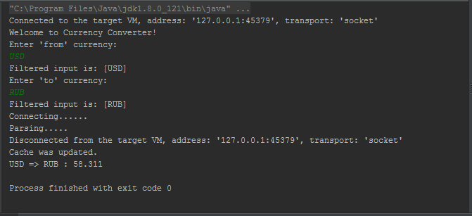
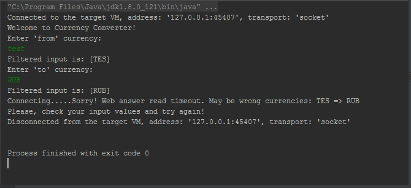

# CurConv
Currency converter on Java (no GUI).

1) User must enter to console currency pair (ex: USD, RUB) and get from the web their current exchange rate. 

2) Also this data must be cached in file system for offline work. 

3) Application must send HTTP query to server and receive an answer (and sometimes you need to update cache). 

### Additional: 
Assync work (I choosed executor service);

Errors catch (no fatal errors with a crash).

## Screenshots:

